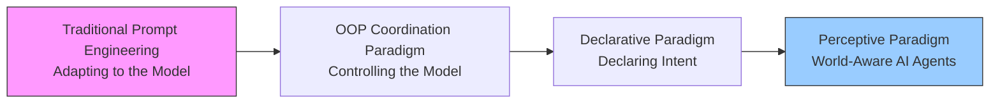
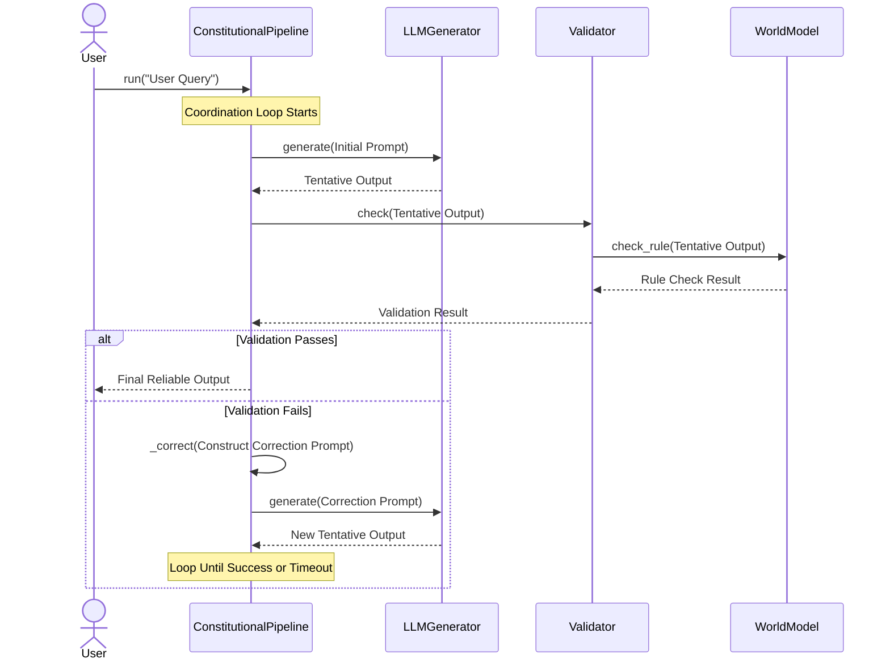

# Constitutional-AI Framework 🛡️

> **Paradigm Manifesto**: We are at a turning point in AI programming paradigms. Traditional prompt engineering and fine-tuning cannot provide deterministic guarantees. This framework proposes a new paradigm: **Perceptive Programming**. Developers declare **Intents** and **Constraints** through objects, which are then reliably executed by AI components with world-awareness. Starting from a solid OOP foundation, we provide you with an evolvable path to the future of AI applications.
>
> **中文**: 我们正处于AI编程范式的转折点。传统提示工程与微调无法提供确定性保障。本框架提出一种新范式：**感知式编程（Perceptive Programming）**。开发者通过对象声明**意图（Intents）**与**约束（Constraints）**，由具备世界感知能力的AI组件可靠执行。我们从坚实的OOP底座出发，为您提供通往未来AI应用的可演进路径。

## 📖 Table of Contents
- [🚀 Paradigm Shift](#🚀-paradigm-shift)
- [✨ Framework Features](#✨-framework-features)
- [🏗️ Core Architecture: Object Model](#🏗️-core-architecture-object-model)
- [🔧 Quick Start: Two Paradigms](#🔧-quick-start-two-paradigms)
- [🧩 Detailed Explanation of Core Classes](#🧩-detailed-explanation-of-core-classes)
- [📁 Project Structure](#📁-project-structure)
- [🤝 How to Contribute](#🤝-how-to-contribute)
- [📜 License](#📜-license)
- [🔮 Future Vision](#🔮-future-vision)

---

## 🚀 Paradigm Shift

Current LLM application development is stuck in the quagmire of "prompt engineering," which essentially **forces developers to adapt to the model**. We believe the future belongs to a new paradigm where **the model adapts to the developer’s intent**.

This framework is the practical embodiment of this belief. It is not just a simple toolkit, but an **evolvable architecture** that allows you to smoothly transition from the familiar OOP style of today to the declarative programming of tomorrow.



## ✨ Framework Features

- **🪙 Dual-Paradigm Support**: Provides both the precise **OOP Coordination Paradigm** (production-ready today) and exploration of the future **Declarative Paradigm** (a window into tomorrow).
- **🔒 Provable Reliability**: Based on the concept of formal verification, it provides deterministic guarantees through the `WorldModel` object to eliminate hallucinations.
- **🧱 Modularity & Evolvability**: Clear abstractions and interfaces. Every component can be replaced or upgraded, witnessing the framework’s evolution from "constrained generation" to "perceptive execution."
- **🧪 Testability**: Based on interface-oriented programming and dependency injection, making each core object easy to mock and test.

## 🏗️ Core Architecture: Object Model

The core of the framework is a "generate-validate" loop based on object collaboration. Its static structure consists of several key objects, and the dynamic collaboration flow is shown in the diagram below, which clearly illustrates how information flows between objects and the decision-making cycle:



## 🔧 Quick Start: Two Paradigms

### Paradigm 1: OOP Coordination Paradigm (Recommended for Production)
**Core Idea**: You act as an "architect," controlling the AI’s behavior flow by composing objects.

```python
# 1. Assemble your AI system components
from constitutional_ai import WorldModel, Validator, LLMGenerator, ConstitutionalPipeline

# Build the knowledge core
medical_constitution = WorldModel.from_json('./world_models/medical_rules.json')
# Build the validation brain
medical_validator = Validator(world_model=medical_constitution)
# Build the generation module
llm_generator = LLMGenerator(model_name="gpt-4")
# Assemble the coordination hub
pipeline = ConstitutionalPipeline(generator=llm_generator, validator=medical_validator)

# 2. Execute reliable tasks
result = pipeline.run("Recommend antipyretics and their usage for a 2-year-old child with a fever")
print(result) # Obtain guaranteed output
```

### Paradigm 2: Declarative Paradigm (Experience the Future)
**Core Idea**: You act as a "director," declaring goals and rules, and letting the AI agent complete the task independently.

```python
# 🚧 (Experimental Feature) Experience intent-declarative programming
from constitutional_ai.experimental import Agent

# Declare your domain, goals, and constraints
medical_agent = Agent.with_rules(
    domain="pediatrics",
    goal="Provide safe and compliant medication advice",
    constraints=["Must strictly adhere to the Chinese Pharmacopoeia 2020 Edition", "Output must include dosage warnings"],
    world_model='./world_models/medical_rules.json'
)

# The system automatically understands and executes
result = medical_agent.execute("Recommend antipyretics for a 2-year-old child with a fever")
```
**Evolution Note**: The second paradigm still calls the objects of the first paradigm under the hood, but it provides a higher-level abstraction and represents the framework’s evolutionary direction.

## 🧩 Detailed Explanation of Core Classes

### 1. `WorldModel` Class
**Responsibility**: Encapsulates domain knowledge and serves as the cornerstone of the framework’s reliability.
**Evolution Path**: In the future, it will evolve from a "static data holder" to a "dynamic perception interface" (`DynamicWorldModel`) that can query knowledge graphs, databases, and APIs on demand.

### 2. `Validator` Class
**Responsibility**: Encapsulates validation logic and acts as the guardian of rules.
**Evolution Path**: In the future, it will integrate formal methods such as theorem provers to provide more powerful validation capabilities.

### 3. `LLMGenerator` Class
**Responsibility**: Encapsulates interactions with LLMs and acts as the executor of capabilities.
**Evolution Path**: Will evolve into a `ToolExecutor` that can not only generate text but also call functions and toolchains.

### 4. `ConstitutionalPipeline` Class
**Responsibility**: Coordinates workflows and acts as the central nervous system of the system.
**Evolution Path**: Will evolve into a `SelfReflectiveAgent` with metacognitive capabilities for planning, reflection, and strategy adjustment.

*(Detailed descriptions of other classes remain unchanged; the focus is on highlighting the evolution path of each class)*

## 📁 Project Structure: Reflecting Architectural Evolution

```
Constitutional-AI/
├── src/
│   └── constitutional_ai/
│       ├── __init__.py
│       ├── core/                    # Core objects (modern paradigm)
│       │   ├── world_model.py
│       │   ├── validator.py
│       │   └── ...
│       ├── experimental/            # Exploration of next-generation paradigms
│       │   ├── __init__.py
│       │   ├── agents.py           # Agent, SelfReflectiveAgent
│       │   └── perception.py       # Prototype of DynamicWorldModel
│       └── generators/
│           └── ...
├── examples/
│   ├── core_paradigm.py            # Modern paradigm examples
│   └── experimental_paradigm.py    # Future paradigm examples
└── tests/
```

## 🤝 How to Contribute: Co-Build the New Paradigm

We welcome you to contribute in various ways to collectively shape the future of programming:
1.  **Strengthen the Present**: Implement new `Generator` classes, enhance `WorldModel` loaders, and write tests.
2.  **Explore the Future**: In the `experimental/` directory, try implementing `DynamicWorldModel` or improving the intent parsing of `Agent`.
3.  **Contribute Use Cases**: Share how you use this framework to solve practical problems in `examples/`, whether using the core paradigm or the experimental paradigm.

## 📜 License
MIT License. See the [LICENSE](LICENSE) file for details.

## 🔮 Future Vision: Perceptive Programming

Our long-term vision is to realize **Perceptive Programming**. Under this paradigm:
- **You**: Are a **conductor** who declares goals, constraints, and domains through high-level language.
- **The Framework**: Is a **symphony orchestra**, where its internal specialized objects (strings = generators, brass = validators, percussion = world models) collaborate under the coordination of an **AI Conductor (Meta-Router)** to independently plan and perform a harmonious piece.
- **Output**: Are **reliable, well-documented outcomes**, as every step of execution is based on perception and reasoning about the real world.

The **Constitutional-AI** framework is precisely the starting point of this vision. Starting from solid OOP practices, it provides you with a trustworthy, evolvable path to that future.

**Join us in redefining the boundaries of programming together.**
